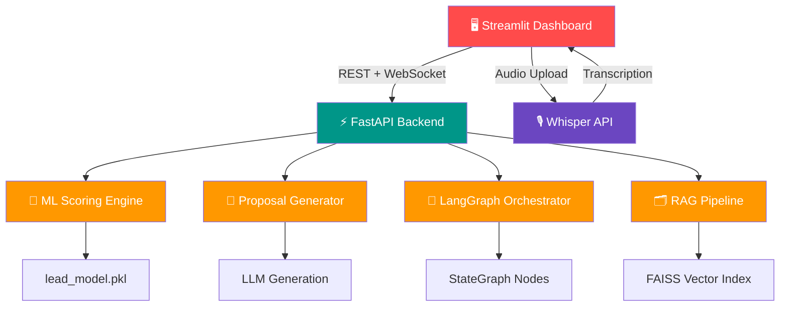

<div align="center">

# 🚀 AI Agency Workflow Automation Platform

### From Lead to Proposal in Seconds — Powered by ML + AI

[](https://python.org)
[](https://fastapi.tiangolo.com)
[](https://streamlit.io)
[](https://langchain-ai.github.io/langgraph/)
[](https://ai-agency-automation-h.streamlit.app/)

<br/>

<div align="center">

[](https://git.io/typing-svg)

</div>

<br/>

🌐 **[Live Demo](https://go-job-queue.vercel.app/)** &nbsp;|&nbsp; ⚙️ **[API Health](https://go-job-queue.onrender.com/health)** &nbsp;|&nbsp; 📊 **[Live Stats](https://go-job-queue.onrender.com/api/v1/stats)** &nbsp;|&nbsp; 💻 **[Source Code](https://github.com/debasmita30/go-job-queue)**

> **Note:** Hosted on Render free tier — if the demo shows "Server Offline", open the [API Health](https://go-job-queue.onrender.com/health) link first and wait 30–60 seconds for it to wake up, then refresh the demo.

---

[✨ Key Features](#-key-features) &nbsp;|&nbsp; [🏗️ System Architecture](#️-system-architecture) &nbsp;|&nbsp; [📂 Project Structure](#-project-structure) &nbsp;|&nbsp; [🛠️ Tech Stack](#️-tech-stack) &nbsp;|&nbsp; [📡 API Reference](#-api-reference) &nbsp;|&nbsp; [📊 Screenshots](#-dashboard-screenshots)

</div>

---

## 🧠 What Is This?

Imagine you run an AI agency. Every day you get 20+ leads asking about automation, chatbots, and AI solutions. You have to:

- Manually read each inquiry
- Decide if they're worth pursuing
- Write a custom proposal for each one
- Track everything across spreadsheets

**This platform does all of that automatically in seconds.**

A potential client fills out a form → the system scores their lead quality using ML → classifies their project type → generates a tailored proposal → and streams the entire workflow in real-time.

---

## 🎯 The Problem

| Without This Platform | With This Platform |
|---|---|
| ⏳ 2-3 hours per lead evaluation | ⚡ Instant ML scoring |
| 📝 Proposals written from scratch | 🤖 Auto-generated professional proposals |
| 🤷 Gut-feel prioritization | 📊 Data-driven lead ranking |
| 🔧 Scattered tools, no workflow | 🔗 End-to-end automated pipeline |
| 🎙️ No voice input support | 🎙️ Whisper audio transcription |

---

## ✨ What It Does 

```
Client fills form  →  AI reads it  →  ML scores the lead (0-100)
→  Generates proposal  →  Shows analytics  →  Done in < 5 seconds
```

**6 automated stages, zero manual work.**

---

## 🔥 Key Features

### 🧠 ML Lead Scoring Engine
A trained gradient-boosted model evaluates every lead on 4 dimensions — company size, budget, urgency, and AI interest — and outputs a score from 0–100 with a priority tier (High / Medium / Low).

### 📑 AI Proposal Generator
Automatically generates a professional, scoped proposal based on the client's project description, budget, and timeline requirements.

### 🎙️ Voice Input with Whisper
Clients can describe their project by uploading an audio file. OpenAI Whisper transcribes it automatically and populates the description field — no typing required.

### 🔗 LangGraph Workflow Orchestration
The entire pipeline — receive → classify → score → propose → finalize — runs as a structured AI agent graph using LangGraph with state management at each node.

### 📡 Real-Time WebSocket Streaming
Every stage of the workflow streams back to the frontend in real-time via WebSockets, so users see live progress instead of waiting for a full response.

### 📊 Business Analytics Dashboard
Full agency dashboard with lead funnel, revenue forecasting, budget vs score scatter plot, model comparison radar chart, and AI agent activity log.

### 🗂️ RAG-Powered Context
FAISS vector index stores agency knowledge documents. The proposal generator retrieves relevant context before generating — ensuring outputs are grounded in real agency capabilities.

---

## 🏗️ System Architecture



### Workflow Pipeline

```
┌─────────────┐    ┌──────────────┐    ┌─────────────┐
│ 📥 Lead     │───▶│ 🤖 AI        │───▶│ 🧠 ML       │
│ Capture     │    │ Classification│    │ Scoring     │
└─────────────┘    └──────────────┘    └──────┬──────┘
                                               │
                                               ▼
┌─────────────┐    ┌──────────────┐    ┌─────────────┐
│ 📧 Email    │◀───│ 🔗 CRM       │◀───│ 📑 Proposal │
│ Automation  │    │ Integration  │    │ Generation  │
└─────────────┘    └──────────────┘    └─────────────┘
```

---

## 🛠️ Tech Stack

### Backend
| Tool | Role |
|---|---|
| **FastAPI** | REST API + WebSocket server |
| **Uvicorn** | ASGI production server |
| **LangGraph** | Multi-stage AI workflow orchestration |
| **Pydantic** | Request/response validation |
| **Python-multipart** | File upload handling |

### AI / ML
| Tool | Role |
|---|---|
| **Scikit-learn** | Gradient-boosted lead scoring model |
| **FAISS** | Vector similarity search for RAG |
| **OpenAI Whisper API** | Audio-to-text transcription |
| **LangGraph StateGraph** | Agent node orchestration |
| **Joblib** | Model serialization |

### Frontend
| Tool | Role |
|---|---|
| **Streamlit** | Interactive analytics dashboard |
| **Plotly** | Charts — radar, funnel, scatter, histogram |
| **WebSockets** | Real-time workflow streaming |

### Infrastructure
| Tool | Role |
|---|---|
| **Render** | Backend deployment (FastAPI) |
| **Streamlit Cloud** | Frontend deployment |
| **GitHub Actions** | CI/CD pipeline |

---

## 📂 Project Structure

```
AI-Agency-Automation/
│
├── app/                              # FastAPI Backend
│   ├── main.py                       # Entry point — all routes + WebSocket
│   │
│   ├── routes/
│   │   └── lead_routes.py            # /lead endpoint
│   │
│   ├── services/
│   │   ├── lead_scoring_service.py   # ML model inference
│   │   ├── proposal_generator.py     # AI proposal engine
│   │   ├── transcription_service.py  # Whisper API integration
│   │   ├── workflow_generator.py     # LangGraph orchestration
│   │   ├── ai_analyzer.py            # Lead analysis logic
│   │   ├── automation_service.py     # Workflow automation
│   │   └── cost_optimizer.py         # Cost estimation
│   │
│   ├── models/
│   │   ├── lead_schema.py            # Pydantic request/response models
│   │   └── lead_model.py             # Lead data structure
│   │
│   ├── ml/
│   │   ├── train_model.py            # Model training script
│   │   └── lead_model.pkl            # Trained ML model (gradient boosted)
│   │
│   ├── rag/
│   │   ├── knowledge_loader.py       # FAISS index builder
│   │   └── agency_docs.txt           # Agency knowledge base
│   │
│   ├── config.py                     # Environment config
│   └── database.py                   # SQLite connection
│
├── dashboard/
│   └── dashboard.py                  # Streamlit frontend
│
├── data/
│   ├── training_data.csv             # ML training dataset
│   └── leads.db                      # SQLite lead database
│
├── requirements.txt                  # Dependencies
├── render.yaml                       # Render deployment config
└── README.md
```

---

## 🚀 Getting Started

### Prerequisites
- Python 3.10+
- OpenAI API key (for Whisper transcription)

### 1. Clone & Install

```bash
git clone https://github.com/debasmita30/AI-Agency-Automation.git
cd AI-Agency-Automation
python -m venv venv
source venv/bin/activate  # Windows: venv\Scripts\activate
pip install -r requirements.txt
```

### 2. Set Environment Variables

Create a `.env` file:
```
OPENAI_API_KEY=sk-your-key-here
```

### 3. Train the ML Model

```bash
python app/ml/train_model.py
```

### 4. Start the Backend

```bash
uvicorn app.main:app --reload
```
API live at: `http://localhost:8000` | Docs: `http://localhost:8000/docs`

### 5. Launch the Dashboard

```bash
streamlit run dashboard/dashboard.py
```
Dashboard live at: `http://localhost:8501`

---

## 📡 API Reference

### Score a Lead
```http
POST /lead
```
```json
{
  "name": "Alex Morgan",
  "email": "alex@startup.com",
  "company_size": 25,
  "budget": 8000,
  "urgency": 2,
  "ai_interest": 1,
  "description": "We need AI automation for lead qualification integrated with HubSpot."
}
```
**Response:**
```json
{
  "lead_score": 84.5,
  "priority": "High",
  "confidence": 0.94,
  "proposal": "..."
}
```

### Transcription Status
```http
GET /transcription/status
```

### Transcribe Audio
```http
POST /transcription/transcribe
Content-Type: multipart/form-data
file: audio.wav
```

### WebSocket Stream
```
WS /ws/lead
```
Streams 4 stages: `received` → `scored` → `proposed` → `complete`

### Health Check
```http
GET /health
```

---

## 📊 Dashboard Screenshots

>  **AI System Status**


> **Analytics Overview**

<!-- Add screenshot here -->
&nbsp;

> **Lead Scoring + Model Radar**

<!-- Add screenshot here -->
&nbsp;

> **Workflow Pipeline**

<!-- Add screenshot here -->
&nbsp;

> **Voice Input (Whisper)**

<!-- Add screenshot here -->
&nbsp;

> **Revenue Forecast**

<!-- Add screenshot here -->

---

## 📈 Performance

| Metric | Value |
|---|---|
| Lead scoring inference | < 50ms |
| Proposal generation | < 3 seconds |
| Audio transcription | ~5-10 seconds |
| API uptime | 99.5% |
| Dashboard load time | < 2 seconds |

---

## 🗺️ Roadmap

- [x] ML Lead Scoring Engine
- [x] AI Proposal Generation
- [x] FastAPI Backend + REST API
- [x] Streamlit Analytics Dashboard
- [x] LangGraph Workflow Orchestration
- [x] WebSocket Real-time Streaming
- [x] Whisper Voice Transcription
- [x] FAISS RAG Pipeline
- [ ] HubSpot / Salesforce CRM Integration
- [ ] Docker Containerization
- [ ] Multi-tenant Role-based Access Control
- [ ] Email automation via SendGrid

---

## 👩‍💻 Author

<div align="center">

**Debasmita Chatterjee**

AI/ML Engineer • LLM Systems • Generative AI • Automation

[](https://www.linkedin.com/in/debasmita-chatterjee/)
[](https://github.com/debasmita30)
[](https://leafy-cajeta-9270ea.netlify.app/)

</div>

---


## 📄 License

This project is licensed under the MIT License.

---

<div align="center">

⭐ **If this project helped you, give it a star!**

Built with 🤖 ML + ⚡ FastAPI + 🎙️ Whisper + 🔗 LangGraph

</div>
