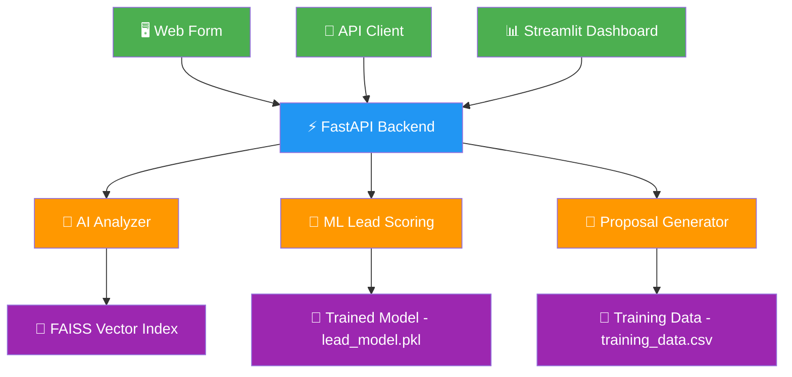

<div align="center">

# 🚀 AI Agency Workflow Automation Platform

### Intelligent Lead Scoring • AI Proposal Generation • Workflow Orchestration

[](https://python.org)
[](https://fastapi.tiangolo.com)
[](https://streamlit.io)
[](https://scikit-learn.org)
[](CONTRIBUTING.md)

<br/>

**An end-to-end AI-powered platform that automates agency operations �� from lead qualification and ML-based scoring to intelligent proposal generation and workflow orchestration.**

[🌐 Live Demo](https://your-deployed-link.streamlit.app) · [📖 Documentation](#-documentation) 

<br/>


</div>

---

## 📋 Table of Contents

- [Overview](#-overview)
- [Key Features](#-key-features)
- [System Architecture](#-system-architecture)
- [Tech Stack](#-tech-stack)
- [Project Structure](#-project-structure)
- [Getting Started](#-getting-started)
- [API Reference](#-api-reference)
- [Dashboard Preview](#-dashboard-preview)
- [Workflow Pipeline](#-workflow-pipeline)
- [Performance Metrics](#-performance-metrics)
- [Roadmap](#-roadmap)
- [Contributing](#-contributing)
- [Author](#-author)
- [License](#-license)

---

## 🎯 Overview

Agencies waste **countless hours** manually qualifying leads, writing proposals, and managing workflows. This platform automates the entire pipeline using **Machine Learning** and **AI-powered generation**.

### The Problem

❌ Manual lead qualification → hours wasted on low-quality leads
❌ Proposal writing from scratch → repetitive, time-consuming
❌ No unified workflow → scattered tools, no automation
❌ Poor analytics → decisions based on gut feeling


### The Solution

✅ ML-powered lead scoring → instant qualification in seconds
✅ AI proposal generation → professional proposals automatically
✅ Workflow orchestration → automated end-to-end pipelines
✅ Real-time analytics → data-driven decision making


---

## ✨ Key Features

<table>
<tr>
<td width="50%">

### 🤖 AI Lead Analysis
Automatically evaluates incoming leads using multiple parameters:
- Company size & industry fit
- Project budget & timeline
- Urgency & AI interest level
- Natural language project description

**Output:** Lead score, priority classification, confidence score

</td>
<td width="50%">

### 🧠 ML Lead Scoring Engine
Trained ML model predicts lead value using structured data:
- Gradient Boosted scoring pipeline
- Feature engineering from raw inputs
- Probability calibration
- Real-time inference via API

**Output:** Score (0-100), deal probability, priority tier

</td>
</tr>
<tr>
<td width="50%">

### 📑 AI Proposal Generation
Generates professional proposals based on:
- Client requirements & constraints
- Project type & complexity
- Industry-specific context
- Budget-aligned recommendations

**Output:** Complete proposal with scope, timeline, pricing

</td>
<td width="50%">

### 🔗 Workflow Automation Builder
Visual automated pipelines (n8n / Zapier style):
- Lead capture → AI classification
- Scoring → Proposal generation
- CRM integration → Email automation
- Configurable multi-step workflows

**Output:** Orchestrated automation pipeline

</td>
</tr>
<tr>
<td colspan="2">

### 📊 Business Analytics Dashboard
Agency-level intelligence powered by **Streamlit + Plotly**:
- Lead funnel visualization & conversion tracking
- Revenue forecasting & budget analysis
- Lead ranking with AI confidence scores
- System health monitoring & performance metrics

</td>
</tr>
</table>

---

## 🏗 System Architecture



## 🛠 Tech Stack

### Backend & API
| Technology | Purpose | Version |
|-----------|---------|---------|
|  | Core Language | 3.10+ |
|  | REST API Framework | 0.100+ |
|  | ASGI Server | 0.23+ |
|  | Data Validation | 2.0+ |

### AI / Machine Learning
| Technology | Purpose | Version |
|-----------|---------|---------|
|  | ML Lead Scoring | 1.3+ |
|  | LLM Integration | Latest |
|  | Deep Learning Backend | 2.0+ |
|  | Vector Search (RAG) | Latest |

### Frontend & Visualization
| Technology | Purpose | Version |
|-----------|---------|---------|
|  | Dashboard UI | 1.28+ |
|  | Interactive Charts | 5.0+ |

---

## 📂 Project Structure


ai-agency-workflow-automation/

│
├── 🚀 app/                              # Backend Application

│   ├── main.py                          # FastAPI entry point

│   │
│   ├── routes/
│   │   └── lead_routes.py               # API endpoints for leads
│   │
│   ├── services/

│   │   ├── lead_scoring_service.py      # ML scoring logic
│   │   ├── proposal_generator.py        # AI proposal engine
│   │   ├── ai_analyzer.py              # Lead analysis service
│   │   ├── automation_service.py        # Workflow automation
│   │   ├── cost_optimizer.py            # Cost optimization
│   │   └── workflow_generator.py        # Workflow builder
│   │

│   ├── models/

│   │   ├── lead_schema.py              # Pydantic data models
│   │   └── lead_model.py               # Lead data model
│   │

│   ├── ml/
│   │   ├── train_model.py              # Model training script
│   │   └── lead_model.pkl              # Trained ML model
│   │

│   ├── rag/
│   │   ├── knowledge_loader.py         # RAG document loader
│   │   └── agency_docs.txt             # Knowledge base
│   │

│   ├── config.py                        # App configuration
│   └── database.py                      # Database connection
│

├── 📊 dashboard/
│   └── dashboard.py                     # Streamlit analytics UI
│

├── 📁 data/
│   ├── training_data.csv                # Training dataset
│   └── leads.db                         # SQLite database
│

├── 🎬 demo/
│   └── demo_leads.json                  # Sample lead data
│

├── 🔗 workflows/
│   └── n8n_workflow.json                # n8n automation workflow
│

├── 📁 .github/
│   └── workflows/
│       └── ci.yml                       # CI/CD pipeline
│

├── requirements.txt                      # Python dependencies
├── run.sh                               # Startup script
├── .gitignore                           # Git ignore rules
├── LICENSE                              # MIT License
└── README.md                            # Documentation


> **Total Files:** 25+ | **Languages:** Python | **Framework:** FastAPI + Streamlit

---

## 🚀 Getting Started

### Prerequisites

- **Python 3.10+**
- **pip** (package manager)
- **Git**

### Installation

#### 1️⃣ Clone the Repository

```bash
git clone https://github.com/yourusername/ai-agency-workflow-automation.git
cd ai-agency-workflow-automation

2️⃣ Create Virtual Environment
bash

Copy code
python -m venv venv

# Windows
venv\Scripts\activate

# macOS / Linux
source venv/bin/activate

3️⃣ Install Dependencies
bash

Copy code
pip install -r requirements.txt

4️⃣ Train the ML Model
bash

Copy code
python app/ml/train_model.py

✅ This generates lead_model.pkl used for real-time scoring.

5️⃣ Start the Backend API
bash

Copy code
uvicorn app.main:app --reload

🟢 API available at: http://127.0.0.1:8000
📖 Swagger Docs: http://127.0.0.1:8000/docs

6️⃣ Launch the Dashboard
bash

Copy code
streamlit run dashboard/dashboard.py

🟢 Dashboard available at: http://localhost:8501

📡 API Reference
Analyze Lead
http

Copy code
POST /api/leads/analyze

Request Body
json

Copy code
{
  "company_name": "TechCorp AI",
  "contact_email": "john@techcorp.com",
  "project_type": "AI Chatbot",
  "budget": 50000,
  "urgency": "high",
  "company_size": 150,
  "ai_interest_level": 9,
  "description": "Need an AI-powered customer service chatbot with RAG capabilities"
}

Response
json

Copy code
{
  "status": "success",
  "data": {
    "lead_score": 84.5,
    "priority": "High",
    "confidence": 0.94,
    "deal_probability": 0.78,
    "recommended_action": "Immediate follow-up",
    "proposal": {
      "title": "AI Chatbot Development Proposal for TechCorp AI",
      "scope": "...",
      "timeline": "8-10 weeks",
      "estimated_cost": "\$45,000 - \$55,000"
    }
  }
}

📊 Dashboard Preview
<div align="center">
Analytics Overview	Lead Funnel
📈 Revenue forecasting & trends	🔄 Conversion pipeline tracking
Workflow Builder	Lead Scoring
⚡ Automated pipeline visualization	🎯 ML-powered scoring results
</div>
Key Metrics at a Glance
Metric	Sample Value	Description
🎯 Lead Score	84.5 / 100	ML-predicted lead quality
📊 Deal Probability	78%	Likelihood of conversion
⚡ Priority	High	Auto-classified urgency tier
🔒 Confidence	94%	Model prediction confidence
💰 Revenue Forecast	$75,000	Projected pipeline value
📈 Predicted Deals	15	Expected conversions this month
🔗 Workflow Pipeline
markdown

Copy code
┌──────────────┐     ┌──────────────┐     ┌──────────────┐
│              │     │              │     │              │
│  📥 Lead     │────▶│  🤖 AI       │────▶│  🧠 ML       │
│  Capture     │     │  Classification    │  Scoring     │
│              │     │              │     │              │
└──────────────┘     └──────────────┘     └──────┬───────┘
                                                  │
                                                  ▼
┌──────────────┐     ┌──────────────┐     ┌──────────────┐
│              │     │              │     │              │
│  📧 Email    │◀────│  🔗 CRM      │◀────│  📑 Proposal │
│  Automation  │     │  Integration │     │  Generation  │
│              │     │              │     │              │
└──────────────┘     └──────────────┘     └──────────────┘

Each step is automated — no manual intervention required.

🗺 Roadmap
 ML Lead Scoring Engine
 AI Proposal Generation
 FastAPI Backend
 Streamlit Analytics Dashboard
 Workflow Pipeline Visualization
 🔲 Drag-and-drop Workflow Builder (n8n style)
 🔲 CRM Integrations (HubSpot / Salesforce)
 🔲 LLM Cost Optimization Engine
 🔲 Docker Containerization
 🔲 Multi-Agent Orchestration (CrewAI / LangGraph)
 🔲 Real-time WebSocket Updates
 🔲 Role-based Access Control
🤝 Contributing
Contributions are welcome! Here's how:

Fork the repository
Create a feature branch (git checkout -b feature/amazing-feature)
Commit changes (git commit -m 'Add amazing feature')
Push to branch (git push origin feature/amazing-feature)
Open a Pull Request
👩‍💻 Author
<div align="center">
Debasmita Chatterjee
AI / ML Engineer — Generative AI • LLM Systems • AI Automation
